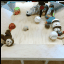

@settings {
  arrow-min-width: 0;
  arrow-min-height: 0;
  arrow-width: 5;
  arrow-height: 3;
}

## Video Prediction with Diffusion models

You can use the [editor on GitHub](https://github.com/Tobi-r9/tobi-r9.github.io/edit/main/README.md) to maintain and preview the content for your website in Markdown files.
In this post we present a conditionally trained Video Diffusion Model which is able to succeed at several tasks, such as video generation, video prediction or inpainting. To adapt the Diffusion model from https://github.com/openai/improved-diffusion for Videos, we use 3D Convolutions. 

### Training
when training Video Diffusion models unconditionally, the generation works very well. However, conditional generation, by conditioning each diffusion step on some frames, does not create harmonic Videos. To overcome this we experimented with autoregressive resampling, predicting frame by frame and sample every step several times. This does help to some degree, but details are still not harmonized between the conditioned and predicted frames and increasing the resampling steps becomes unfeasible at some point. 
Unconditionally trained model on Video prediction conditioned on one frame  
  &rarr;   


Alternatively we propose to train the model conditionally. During training, we choose k random frames (where k is also randomly chosen each training step) which we do not diffuse. 
### Experiments on Bair

We train on the Bair dataset with 20 frames and each step we do not diffuse up to 4 random frames. First we show the results of the typicall Bair prediction protocoll (i.e. conditioning on one frame and predicting the next 15)

As the frames we condition on during training were chosen randomly, we can use the same model also for filling and generation.


```markdown
Syntax highlighted code block

# Header 1
## Header 2
### Header 3

- Bulleted
- List

1. Numbered
2. List

**Bold** and _Italic_ and `Code` text

[Link](url) and 
```

For more details see [Basic writing and formatting syntax](https://docs.github.com/en/github/writing-on-github/getting-started-with-writing-and-formatting-on-github/basic-writing-and-formatting-syntax).

### Jekyll Themes

Your Pages site will use the layout and styles from the Jekyll theme you have selected in your [repository settings](https://github.com/Tobi-r9/tobi-r9.github.io/settings/pages). The name of this theme is saved in the Jekyll `_config.yml` configuration file.

### Support or Contact

Having trouble with Pages? Check out our [documentation](https://docs.github.com/categories/github-pages-basics/) or [contact support](https://support.github.com/contact) and we’ll help you sort it out.
